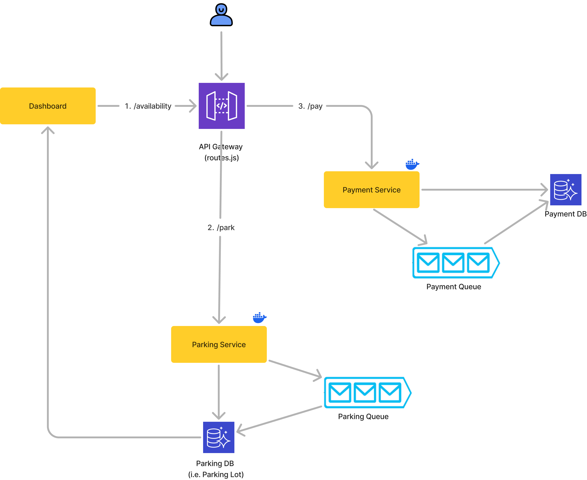
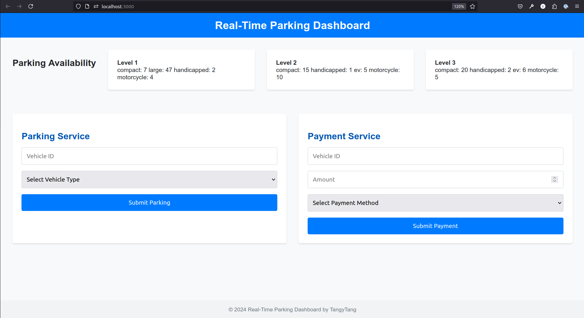

# Real-Time Parking Lot Project



### High-level Architecture

The real-time parking lot system comprises **two backend microservices**—Payment and Parking—and **one frontend microservice**, Dashboard.

The **Parking service** initializes various parking spot types during the [database setup process](services/parking/src/database/parkingLotData.js).

Each microservice runs within a [Docker container](docker-compose.yml) and leverages a **Queue system** implemented with RabbitMQ. When the queue experiences a backlog, the system dynamically [scales up](services/parking/src/services/parkingService.js) the number of workers for the Parking and Payment services. Once the backlog is cleared, the system [automatically scales down](services/parking/src/services/parkingService.js) the workers, optimizing resource usage and reducing costs in production.

The **React-based frontend** [Dashboard](services/dashboard) interfaces with the Payment and Parking services. Detailed setup instructions are provided below.

### Data Structures & Classes

The **Vehicle** class captures the type of vehicle, while the **ParkingSpot** class provides methods for occupying a parking spot with a vehicle. The **ParkingFloor** class includes methods to search for available parking lots, streamlining parking allocation. These classes are organized under the `/services/parking/src/models` directory. Similarly, the **Payment** class, located in `/services/payment/src/models`, contains methods to track the payment status of vehicles, ensuring accurate and real-time payment processing.

### Real-time Support

To handle concurrent transactions, payment processing, and real-time updates of parking spot availability, the system leverages RabbitMQ, Docker, and WebSockets for efficient and scalable communication and processing.

RabbitMQ is employed to queue all transactions, ensuring that parking and payment requests are processed in the order they arrive. This architecture decouples producers (API servers) and consumers (services), enabling the system to handle transactions sequentially while providing several key benefits:

1. **Retry Mechanism**: If a transaction, such as a parking or payment request, fails, RabbitMQ can requeue the transaction for another processing attempt, ensuring reliability.
2. **Scalability**: By decoupling producers and consumers, RabbitMQ allows individual services to scale independently. For instance, the parking service can use Docker to scale the number of instances, enabling multiple parking requests to be processed in parallel without impacting other services.

Docker further enhances scalability by enabling the dynamic creation of service instances. For example, the parking service can be scaled up or down based on the length of the RabbitMQ queue, ensuring optimal performance during peak loads.

WebSockets are integrated into the frontend (React) to provide real-time updates on payment, parking, and availability statuses. This ensures that users receive immediate feedback, such as confirmation of parking or payment, and up-to-date information about available parking spots.

This approach ensures a robust, scalable, and responsive system capable of handling high volumes of transactions efficiently.

### Reliability, Security, and Scalability

1. **Adopt Microservices Architecture**: Implement a microservices-based design to ensure each service adheres to the principle of single responsibility. This modular approach enhances maintainability, fault isolation, and the ability to scale individual components independently.

2. **Secure API Gateway**: Place all services behind an API Gateway to act as a single entry point for external requests. Incorporate robust authentication and authorization mechanisms, such as access tokens, to secure routes and protect sensitive operations.

3. **Leverage RabbitMQ for Asynchronous Processing**:
   - Introduce a queuing system using RabbitMQ to handle transactions reliably and decouple services.
   - Enable horizontal scaling by deploying multiple consumer instances to process transactions in parallel, ensuring scalability during peak loads.
   - Allow the parking service to operate independently of the payment service by queuing transactions, ensuring that a failed payment does not block parking operations.
   - Process payments asynchronously to optimize throughput while maintaining transaction integrity.

By combining these approaches, the parking system can achieve high reliability, strong security, and the scalability needed to handle fluctuating demand efficiently.

### Test Cases

To ensure the correctness and robustness of the system, test cases have been developed and organized within their respective service directories, such as `/services/parking/src/test` and `/services/payment/src/test`. They are automatically executed as part of the Docker Compose process defined in the `docker-compose.yml` file.

### Benefits of Containers (Docker)

To containerize the microservices, Docker is used to package each service, along with its dependencies, into isolated and portable containers. Each service (e.g., parking, payment, and dashboard) is defined with its own Dockerfile, specifying its runtime environment, dependencies, and startup commands. These containers are then orchestrated using Docker Compose to ensure smooth inter-service communication and manageability

1. **Consistent Development Environment**:

   - Docker provides a consistent runtime environment across development, testing, and production, eliminating the "it works on my machine" problem. This ensures seamless testing and troubleshooting for developers.

2. **Scalability**:

   - Containers can be scaled up or down to meet demand by adjusting the number of instances for each service. For example, the parking service can be scaled horizontally to handle high volumes of parking transactions.

3. **Infrastructure as Code**:

   - Dockerfiles and `docker-compose.yml` serve as documentation for the exact working environment of the system. This allows reproducibility and ensures new team members can set up the system quickly.

4. **Rollbacks**:

   - Docker images enable easy rollbacks to previous working versions of the environment, minimizing downtime during deployment issues or unforeseen bugs.

5. **Version Testing**:
   - Different versions of services can coexist in separate containers. For example, some containers can use older versions of the payment service while testing new updates in others, ensuring a smooth transition to production.

### Getting Started



1. **Start the System**:  
   Navigate to the root directory and execute the following command to build and start all services:

   ```bash
   docker compose up --build
   ```

2. **Run Test Cases**:  
   Allow Docker to complete the automated test cases. As the test cases execute, the parking availability will update dynamically (e.g., reducing as parking spots are occupied).

3. **Test the Parking Service**:  
   Input vehicle details into the **Parking Service** form and observe how the **Parking Availability** updates in real time.

4. **Test the Payment Service**:  
   Enter payment details into the **Payment Service** form and ensure the system processes the payment correctly, reflecting updates in the dashboard.
